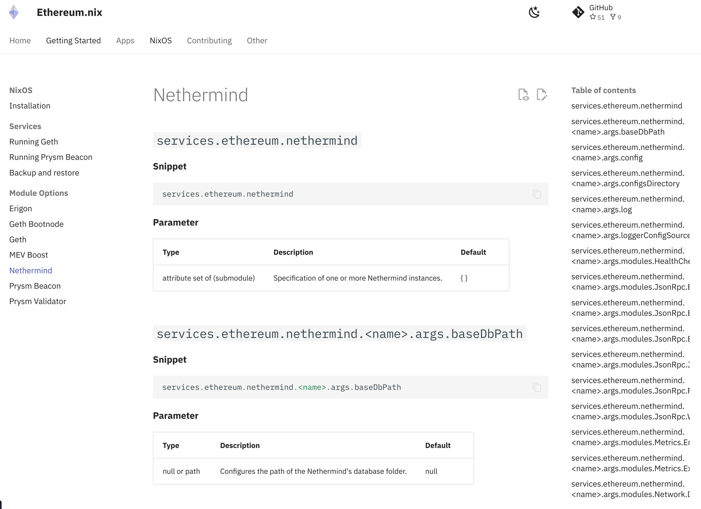

# NixOsOptionsPlugin for MkDocs

`NixOsOptionsPlugin` is a plugin for [MkDocs](https://www.mkdocs.org/), a static site generator focused on building project documentation. The plugin allows for the seamless rendering of NixOS module options within your MkDocs-powered documentation. NixOS module options are fundamental aspects of NixOS configuration and having them clearly represented in your documentation can greatly enhance understandability.

This plugin was develop specifically for [Ethereum.nix](https://nix-community.github.io/ethereum.nix/), so the use-case it's still very basic. Below you can see an screenshot of the end result:



## Getting started

To make the most of this repository, you should have the following installed:

- [Nix](https://nixos.org/)
- [Direnv](https://direnv.net/)

After cloning this repository and entering inside, run `direnv allow` when prompted, and you will be met with following prompt.

```terminal
🔨 Welcome to mkdocs-nixos-options

[Tools]

  check  - Checks the source tree
  fmt    - Format the source tree

[general commands]

  menu   - prints this menu

[python]

  pytest - Invoke pytest directly
```

It will also load required dependencies like `python`, `poetry`, `pytest` and `alejandra` to quickly develop.

## Installation

You can install `NixOsOptionsPlugin` using pip:

```bash
pip install mkdocs-nixos-options-plugin
```

Also, the plugin has been added to `nixpkgs`, so you can use it directly within a custom `mkdocs` derivation that includes the plugin.

## Usage

In order to use this plugin, add it to your mkdocs.yml:

```yaml
plugins:
  - search
  - nixos-options:
      enable: true
      nix_bin: nix # default value
      template: default # default value
```

This plugin looks for a specific marker (`::nixos-options::`) in your markdown files, replacing it with the desired NixOS module options. The marker must be surrounded with the module path you want to include, like this: `::nixos-options::module_path::`.

The plugin calls the Nix binary to evaluate the expression and retrieve the options, and then these options are rendered using a Jinja2 template. You can specify a custom template in the plugin configuration using the template option. If no custom template is provided, a default one is used.

```
## Here are some NixOS options

::nixos-options::path_to_your_module::
```

## Configurable options

- `enable` (`bool`): If set to false, the plugin will not process any NixOS options. Default is `true`.
- `nix_bin` (`str`): Specifies the path to the nix binary. Default is `nix`.
- `template` (`str`): Specifies the template to use when rendering the NixOS options. Default is `default`.

## Debugging

This plugin uses the standard Python logging module. To see debug output, run mkdocs with the `-v` or `--verbose` flag.

## Contributing

Contributions are welcome! Please feel free to submit a Pull Request.

## License

This project is licensed under the MIT license. See the [LICENSE](./LICENSE.md) file for more details.
